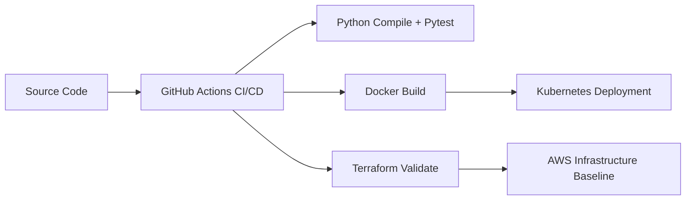

# CI/CD Pipeline & Automated Infrastructure
Delivery-and-operations portfolio project aligned to ANZSCO 261312 (Developer Programmer).

## Portfolio Context
- Full ANZSCO 261312 portfolio landing page: [projects-workspaces](https://github.com/jen-the-dev/projects-workspaces)
- Application cover letter template in this repository: [cover-letter-anzsco-261312.md](cover-letter-anzsco-261312.md)
- Related core showcase repositories:
  - [cloud-native-task-management-api](https://github.com/jen-the-dev/cloud-native-task-management-api)
  - [multi-platform-ecommerce-web-app](https://github.com/jen-the-dev/multi-platform-ecommerce-web-app)
  - [realtime-data-streaming-dashboard](https://github.com/jen-the-dev/realtime-data-streaming-dashboard)

## Problem
Teams often deliver application code without a repeatable deployment pipeline, resulting in inconsistent releases and fragile infrastructure changes.

## Solution
This repository provides an end-to-end delivery scaffold:
- Python service with health endpoint,
- container build definition,
- Kubernetes runtime manifests,
- Terraform infrastructure definitions,
- CI pipeline that runs compile checks, tests, image build, and Terraform validation.

## Architecture Diagram

## Tech Stack
- Python + Flask
- Pytest
- Docker
- Kubernetes
- Terraform (AWS starter resources)
- GitHub Actions

## Setup Instructions
1. `pip install -r app/requirements.txt`
2. `python app/main.py`
3. `python -m pytest tests -q`
4. `docker build -t portfolio-cicd-app .`
5. `terraform -chdir=terraform init -backend=false && terraform -chdir=terraform validate`

## Testing
- Unit test: `tests/test_app_unit.py`
- Integration-style endpoint test: `tests/test_app_integration.py`
- Run suite:
  - `python -m pytest tests -q`

## ANZSCO 261312 Competency Evidence
- **Software development and maintenance**: service implementation in `app/main.py`.
- **Testing and debugging**: automated Python test coverage in `tests/`.
- **Deployment and platform integration**: container and Kubernetes assets in `Dockerfile` and `k8s/deployment.yaml`.
- **Infrastructure automation**: Terraform resources in `terraform/main.tf` plus CI workflow in `.github/workflows/ci-cd.yml`.

## Commit Convention
Use Conventional Commits:
- `feat(ci): add image scan stage to pipeline`
- `fix(terraform): correct provider version constraint`
- `test(app): add health endpoint integration coverage`
- `docs(readme): expand setup and architecture sections`

## Evidence Map
- Application code: `app/main.py`
- Tests: `tests/`
- Containerization: `Dockerfile`
- Kubernetes manifests: `k8s/deployment.yaml`
- Terraform configuration: `terraform/main.tf`
- CI/CD workflow: `.github/workflows/ci-cd.yml`
